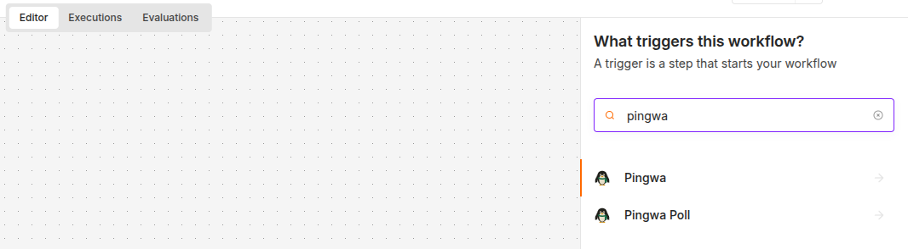
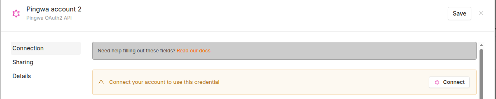
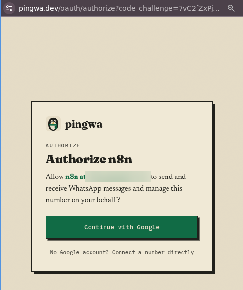
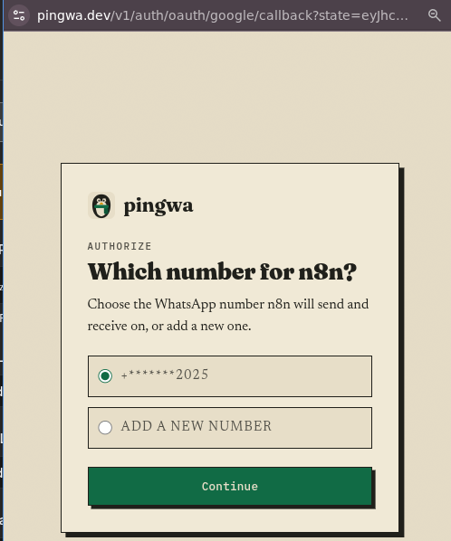
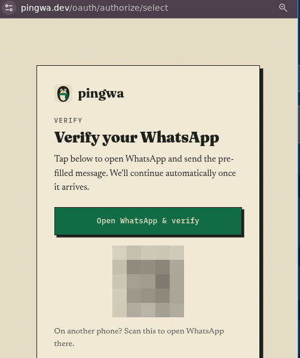
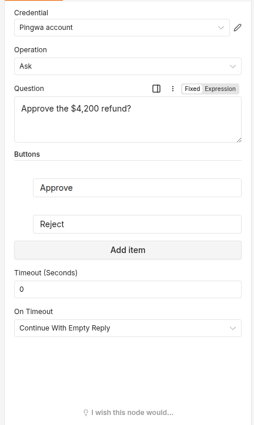

# n8n-nodes-pingwa

Send WhatsApp messages from n8n — and **ask a human a question and wait for the
answer** — without owning a WhatsApp number or touching the Meta API.

This is the community node for [pingwa](https://pingwa.dev). Your agent notifies
you on WhatsApp, asks you to approve or reject a step, and reads your reply back
into the workflow.

## Setup takes about 30 seconds

Other WhatsApp nodes make you bring your own number and register it with the
WhatsApp Business API — Meta business verification, a phone number, a review that
can take days. Pingwa needs none of that. Pingwa owns the number; you just link
your own WhatsApp to it.

### 1. Install the node

In n8n: **Settings → Community Nodes → Install**, then enter:

```
n8n-nodes-pingwa
```

The `Pingwa`, `Pingwa Trigger`, and `Pingwa Poll Trigger` nodes appear in the
node panel.



### 2. Get connected — pick one

**One-click (easiest):**

1. Add a **Pingwa OAuth2 API** credential and click **Connect**.

   

2. A pingwa tab opens. **Continue with Google** (or connect a number directly).

   

3. Choose which WhatsApp number n8n sends and receives on, or add a new one.

   

4. New number only — tap **Open WhatsApp & verify** and send the pre-filled
   message (or scan the QR from another phone). Pingwa spots it and continues on
   its own. No code to type.

   

5. The tab closes and n8n stores the token, refreshing it for you from then on.

Picking a number that is already verified skips step 4 — you go straight back to
n8n.

**API key (no browser step):**

1. Open WhatsApp and send `join` to the pingwa number.
2. Pingwa replies with your key (`pw_...`).
3. Add a **Pingwa API** credential and paste it.

That is the whole setup. Messages go to *your own* WhatsApp — there is no
recipient to configure and no way to spam anyone else.

> Leave **Base URL** at its default (`https://pingwa.dev`). Change it only if you
> run a self-hosted or staging pingwa.

## The nodes

### Pingwa — Notify

Fire-and-forget message, no reply expected.

- **Operation**: Notify
- **Message**: `Backup finished: 42 GB in 6 minutes.`
- **Image URL**: optional, must be public `https`
- **Idempotency Key**: optional; resending with the same key does not send twice

Output: `{ id, billing_class, status }`

### Pingwa — Ask

Send a question and hold the workflow until you answer, or until timeout. This is
the human-in-the-loop step nothing else on WhatsApp gives you.

- **Operation**: Ask
- **Question**: `Approve the $4,200 refund?`
- **Buttons**: `Approve`, `Reject`
- **Timeout (Seconds)**: `0` for the server default, or set your own
- **On Timeout**: continue with an empty reply, or fail the node

Output: `{ message_id, billing_class, answered, reply }`. On timeout with
"Continue" selected: `{ answered: false, timedOut: true, message_id }`.



### Pingwa — Get Reply

Fetch the reply to a message sent earlier (by Ask or Notify) without holding an
execution open.

- **Operation**: Get Reply
- **Message ID**: the `id` from a prior Notify or Ask
- **Wait (Seconds)**: long-poll up to this many seconds; `0` returns at once

Output: `{ message_id, answered, reply }`

### Pingwa Trigger (webhook) vs Pingwa Poll Trigger

Both start a workflow on an inbound WhatsApp message. Pick by how your n8n is
reachable:

- **Pingwa Trigger** — use if n8n has a public `https` URL. Pingwa registers a
  webhook on activation and removes it on deactivation, and pushes each message
  the moment it arrives. Emits `{ event, message_id, body, button_id,
  reply_to_message_id, wa_message_id, window_open, created_at, media? }`.
- **Pingwa Poll Trigger** — use if n8n is local, LAN-only, or behind a firewall.
  It pulls `/v1/inbox` on an interval. Same fields **minus `window_open` and
  `media`** — the `/v1/inbox` endpoint does not return them, so inbound images
  and voice notes arrive only through the webhook.

Both nodes take an **Events** option: All Inbound Messages or Replies Only.

## License

MIT
